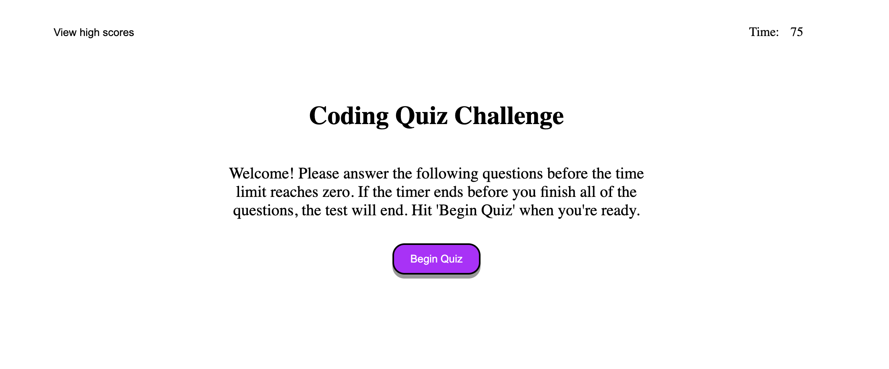
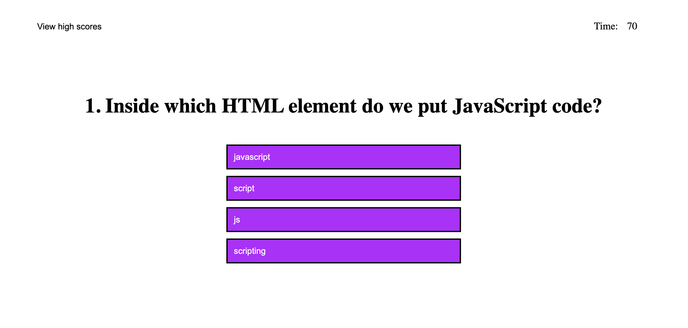
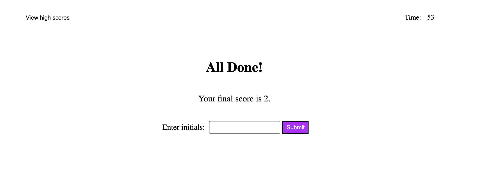
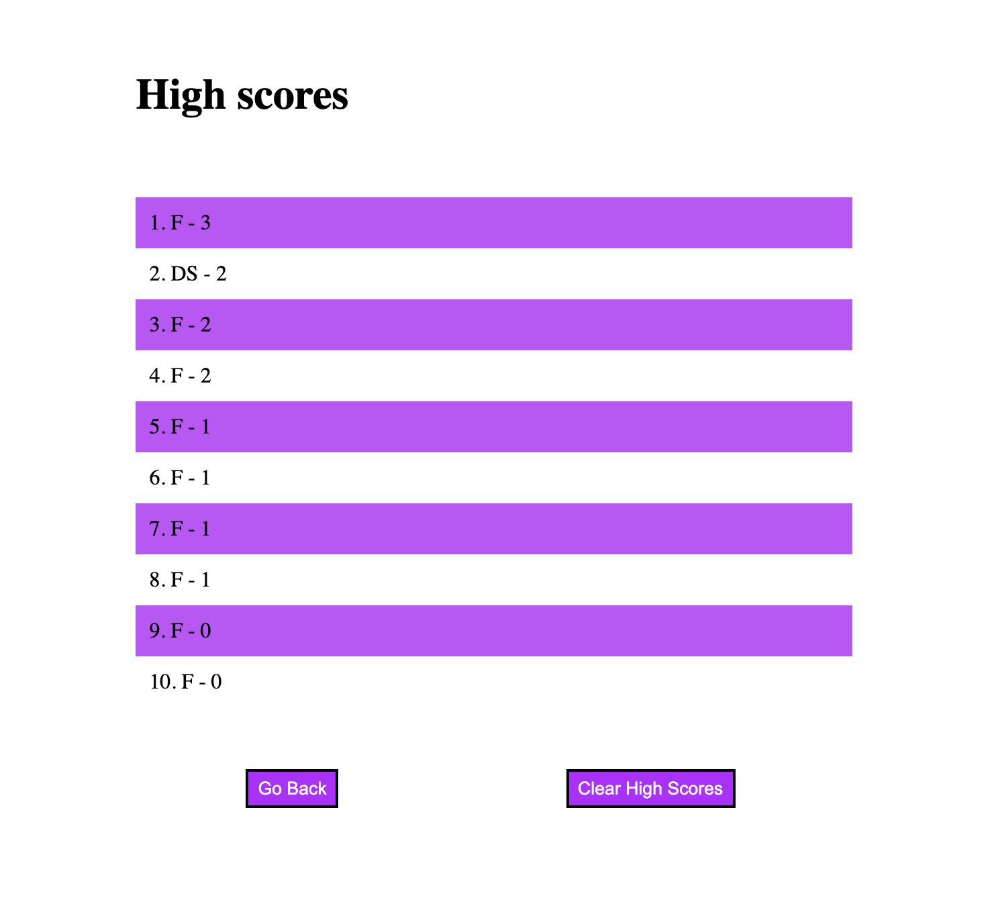

# Code Quiz
## Introduction
This is short quiz built to test knowledge on JavaScript fundamentals and on completion allows for the saving of quiz scores to the browser's local storage.

## How it works
The website was created using HTML, CSS, and JavaScript, with the JavaScript code providing most of the functionality behind the scenes. Using a variety of JavaScript tools such as event listeners, object variables, loops, and timing events to give the user a real quiz experience. Using each of these tools and more allows the user to click on buttons, select right or wrong answers, generate new questions, and start a timer based on the quiz. 

https://chaldrich24.github.io/code-quiz/

